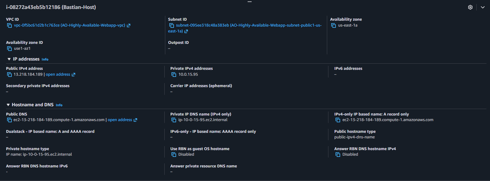
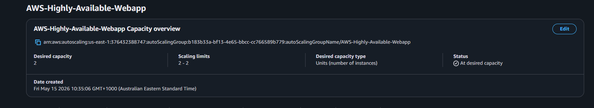

## Connect With Me

- X: https://x.com/0ndiba
- LinkedIn: https://www.linkedin.com/in/arnold-ondiba/
- GitHub: https://github.com/ArnOndiba

# Aws-Highly-Available-Webapp
Hands-on AWS cloud infrastructure project demonstrating highly available web architecture using VPC, public/private subnets, bastion hosts, load balancers, Auto Scaling Groups, and EC2 instances.

# Project Goal
The goal of this project is to build and understand a highly available AWS web infrastructure using hands-on implementation rather than memorization.

This project focuses on:
- AWS networking fundamentals
- Public and private subnet architecture
- Bastion host access
- Load balancing
- Auto Scaling Groups
- Linux server management
- Infrastructure troubleshooting

The entire learning process is being documented through GitHub, LinkedIn, and X.

# Services Used

- Amazon VPC
- EC2
- Auto Scaling Groups
- NAT Gateway
- Internet Gateway
- Route Tables
- Security Groups
- Bastion Host Architecture
- AWS CLI
- Linux (Ubuntu)
- Git & GitHub

# Architecture Overview
Initial Architecture Sketch:

This architecture demonstrates a highly available AWS environment using:

- Public and private subnets
- Bastion host access
- Load balancer distribution
- Auto Scaling Groups
- Private EC2 web servers
- Internet Gateway
- NAT Gateway
- Multi-AZ deployment

## 1.Screenshots

## VPC Architecture

This VPC is designed across two Availability Zones for high availability. It includes public subnets for internet-facing resources and private subnets for application servers. The Internet Gateway allows public subnet resources to communicate with the internet, while NAT Gateways allow private instances to access the internet for outbound traffic without exposing them directly.

## Bastion Host Configuration

The bastion host is placed in a public subnet and acts as a secure entry point into the private network. Instead of exposing private EC2 instances directly to the internet, SSH access first goes through the bastion host, then connects internally to private instances using their private IP addresses.

## Auto Scaling Group Configuration

The Auto Scaling Group manages the private EC2 web servers. It maintains the desired number of instances across private subnets and can automatically replace unhealthy or terminated instances. This helps improve availability and supports scalable infrastructure design.

# Lessons Learned

- Public and private subnets are mainly defined by route table behavior.
- Internet Gateways connect the VPC to the public internet.
- NAT Gateways allow outbound internet access for private EC2 instances.
- Private EC2 instances can still serve webpages through a Load Balancer.
- Bastion hosts provide secure SSH access into private infrastructure.
- Traffic direction (inbound vs outbound) is very important in AWS networking.
- Route tables determine where subnet traffic is sent.
- Load Balancers require healthy registered targets to serve traffic properly. 