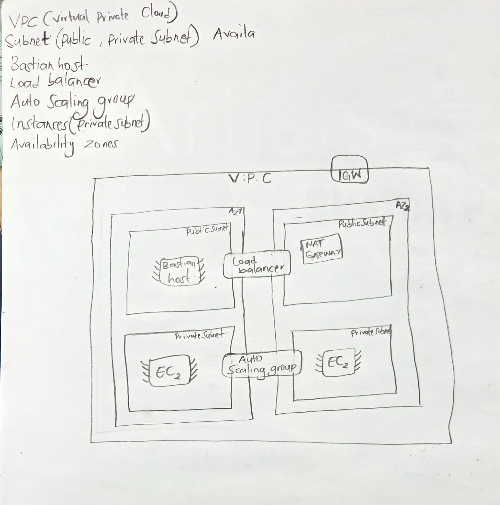

# Aws-Highly-Available-Webapp
Hands-on AWS cloud infrastructure project demonstrating highly available web architecture using VPC, public/private subnets, bastion hosts, load balancers, Auto Scaling Groups, and EC2 instances.

# Project Goal
The goal of this project is to build and understand a highly available AWS web infrastructure using hands-on implementation rather than memorization.

This project focuses on:
- AWS networking fundamentals
- Public and private subnet architecture
- Bastion host access
- Load balancing
- Auto Scaling Groups
- Linux server management
- Infrastructure troubleshooting

The entire learning process is being documented through GitHub, LinkedIn, and X.

# Services Used
- Amazon VPC
- EC2
- Auto Scaling Groups
- Application Load Balancer
- Target Groups
- NAT Gateway
- Internet Gateway
- Security Groups
- AWS CLI
- Linux (Ubuntu)
- Git & GitHub

# Architecture Overview
Initial Architecture Sketch:

This architecture demonstrates a highly available AWS environment using:

- Public and private subnets
- Bastion host access
- Load balancer distribution
- Auto Scaling Groups
- Private EC2 web servers
- Internet Gateway
- NAT Gateway
- Multi-AZ deployment

# Lessons Learned

- Public and private subnets are mainly defined by route table behavior.
- Internet Gateways connect the VPC to the public internet.
- NAT Gateways allow outbound internet access for private EC2 instances.
- Private EC2 instances can still serve webpages through a Load Balancer.
- Bastion hosts provide secure SSH access into private infrastructure.
- Traffic direction (inbound vs outbound) is very important in AWS networking.
- Route tables determine where subnet traffic is sent.
- Load Balancers require healthy registered targets to serve traffic properly. 